# DSO101 Assignment II: CI/CD Pipeline with Jenkins

**Student:** Tshewang Lhamo  
**Student ID:** 02250377  
**Course:** Bachelor's of Engineering in Software Engineering (SWE)  
**Assignment:** Continuous Integration and Continuous Deployment (CI/CD)  
**Date Submitted:** May 9, 2026

> ** Security Note:** Never commit real GitHub tokens, Docker Hub passwords, or any other secrets to version control. Always use environment variables, credential managers, or CI/CD platform credential systems (like Jenkins Credentials) to store sensitive data. The examples shown use placeholder values only.

---

## Project Overview

This assignment demonstrates the implementation of a **Continuous Integration/Continuous Deployment (CI/CD) pipeline** using Jenkins to automate the build, test, and deployment of a Node.js to-do list application.

### What is a CI/CD Pipeline?

A CI/CD pipeline automatically handles:
- **Checkout** - Fetching code from GitHub
- **Install** - Installing npm dependencies
- **Build** - Building the application
- **Test** - Running automated unit tests with Jest
- **Deploy** - Building and pushing Docker images to Docker Hub

This eliminates manual work and ensures code quality before deployment.

---

## Tools & Technologies Used

| Tool | Purpose | Version |
|------|---------|---------|
| **Jenkins** | CI/CD Automation Server | 2.555+ |
| **Node.js** | JavaScript Runtime | 26.1.0 |
| **npm** | Package Manager | Latest |
| **Jest** | JavaScript Testing Framework | ^29.0.0 |
| **jest-junit** | JUnit Report Generator | ^16.0.0 |
| **Docker** | Container Platform | Latest |
| **GitHub** | Source Code Repository | - |
| **Docker Hub** | Container Registry | - |

---

##  Step 1: Set Up GitHub Personal Access Token (PAT)

The first step is to create a GitHub Personal Access Token (PAT) so Jenkins can securely access your repository.

### Process:
1. Go to GitHub Settings > Developer Settings > Personal access tokens > Tokens (classic)
2. Click "Generate new token (classic)"
3. Give it a name (e.g., "Jenkins CI Token")
4. Select scopes: `repo` and `admin:repo_hook`
5. Generate and copy the token

### Screenshot - GitHub PAT Creation:

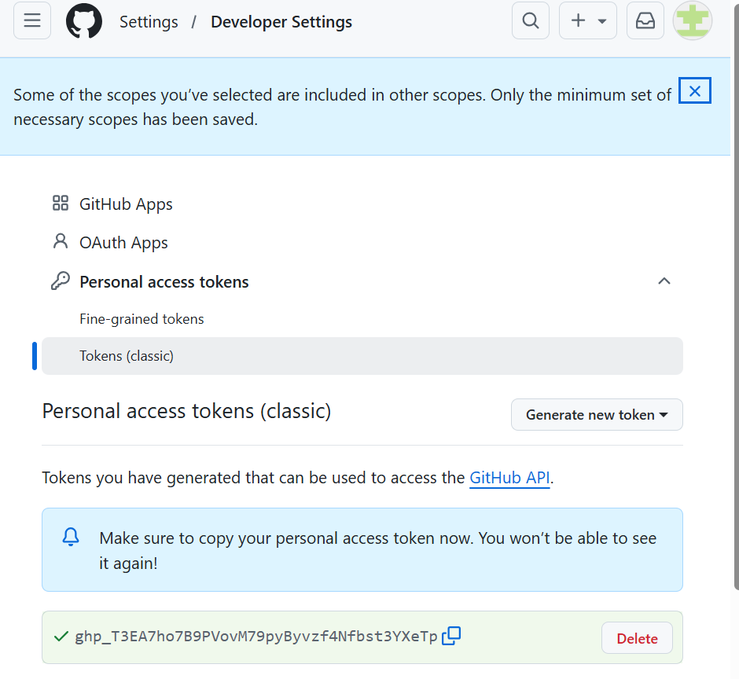

**What this shows:** The GitHub Personal Access Token interface where you can see the generated token that will be used by Jenkins to authenticate with GitHub.

---

## Step 2: Install Jenkins Plugins

Jenkins requires specific plugins to work with Node.js, Docker, and GitHub. These plugins extend Jenkins's functionality.

### Required Plugins:
- **NodeJS Plugin** - For Node.js environment
- **Pipeline** - For pipeline-based jobs
- **GitHub Integration Plugin** - For GitHub integration
- **Docker Pipeline** - For Docker operations

### Process:
1. Go to Jenkins > Manage Jenkins > Plugins > Available plugins
2. Search for each plugin
3. Check the checkbox and click "Install"

### Screenshot - GitHub Integration Plugin Installation:

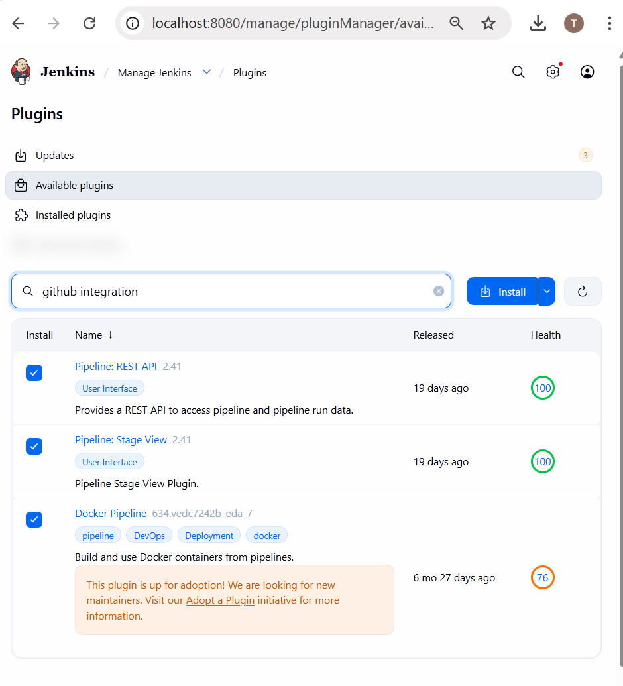

**What this shows:** The Jenkins Manage Jenkins > Plugins page where you can search for and install the "GitHub Integration Plugin". This plugin enables Jenkins to connect with GitHub repositories and receive webhooks.

---

## Step 3: Configure Node.js in Jenkins Tools

After installing the NodeJS plugin, you need to configure the Node.js version that Jenkins will use.

### Process:
1. Go to Jenkins > Manage Jenkins > Tools
2. Scroll to "NodeJS installations"
3. Click "Add NodeJS"
4. Set Name: `NodeJS` (exactly as shown - case-sensitive!)
5. Select Version: `NodeJS 26.1.0` (or your desired LTS version)
6. Click "Save"

### Screenshot - NodeJS Tool Configuration:

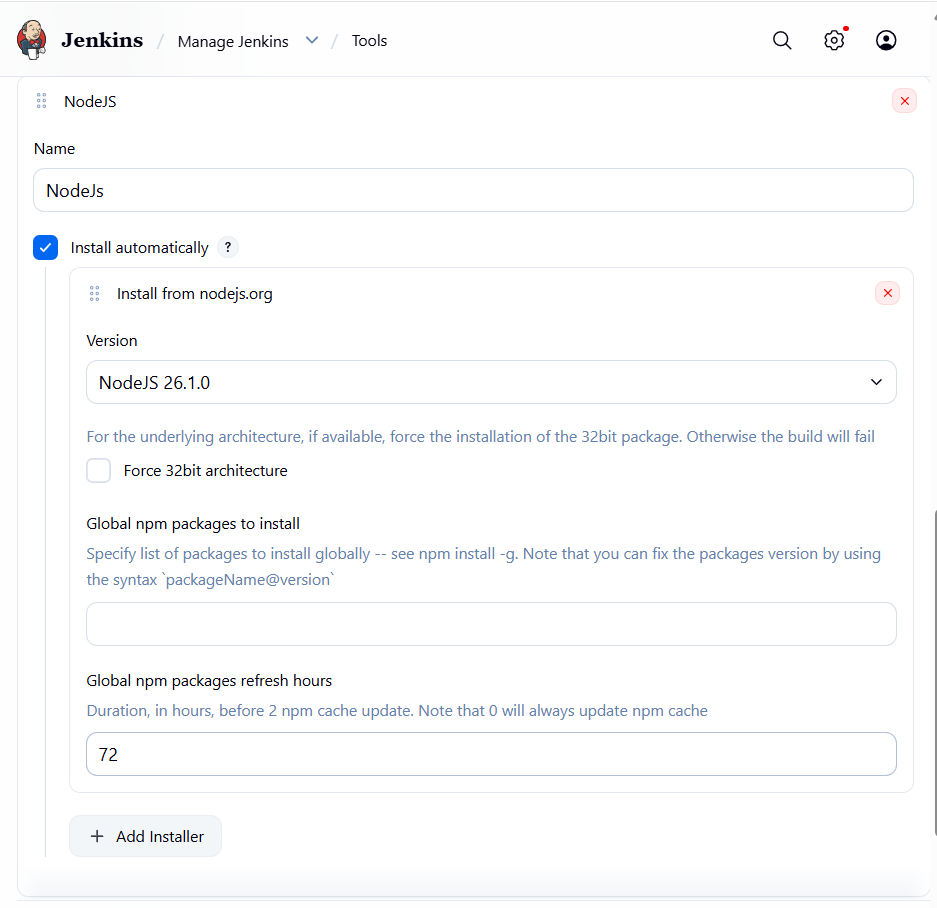

**What this shows:** The Jenkins Tools configuration page with NodeJS setup. The name **"NodeJS"** is critical because the Jenkinsfile references this exact name. The version 26.1.0 is automatically downloaded when the pipeline runs.

---

## Step 4: Add GitHub Credentials to Jenkins

Jenkins needs your GitHub username and PAT to authenticate with your repository.

### Process:
1. Go to Jenkins > Manage Jenkins > Credentials > Global
2. Click "Add Credentials"
3. Select "Username with password"
4. Fill in:
   - **Username:** Your GitHub username (e.g., `twglhamo`)
   - **Password:** Your GitHub PAT token (from Step 1)
   - **ID:** `github-credentials` (important for Jenkinsfile reference)
   - **Description:** `GitHub PAT Token`
5. Click "Create"

### Screenshot - GitHub Credentials Dialog:

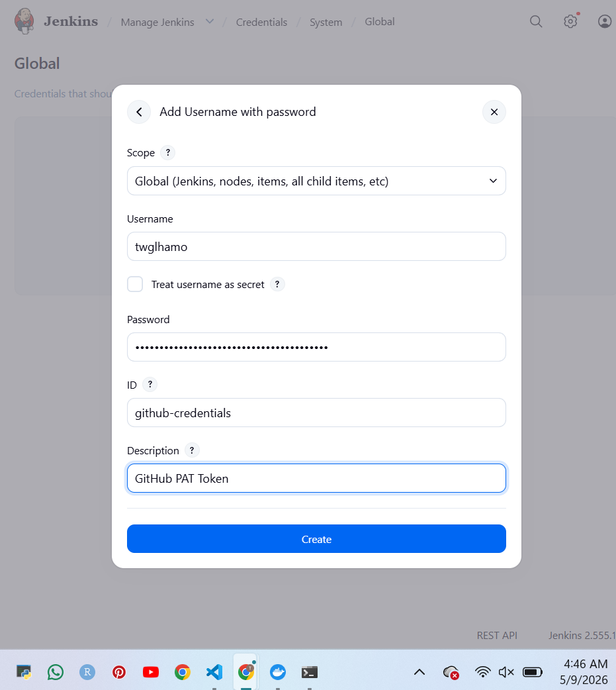

**What this shows:** The "Add Username with password" credentials dialog with:
- Username: Your GitHub username
- Password: Your GitHub Personal Access Token (masked in Jenkins)
- ID: `github-credentials` (must match Jenkinsfile)

### Screenshot - GitHub Credentials Created:

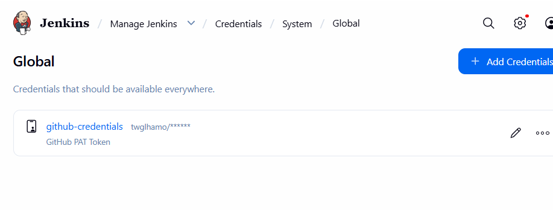

**What this shows:** The Jenkins Global Credentials page confirming that `github-credentials` has been created successfully. This credential is now available for the Jenkinsfile to use.

---

## Step 5: Add Docker Hub Credentials to Jenkins

Similarly, Jenkins needs Docker Hub credentials to push the Docker image.

### Process:
1. Create a Docker Hub account at https://hub.docker.com
2. In Jenkins > Manage Jenkins > Credentials > Global > Add Credentials
3. Select "Username with password"
4. Fill in:
   - **Username:** Your Docker Hub username (e.g., `twglhamo`)
   - **Password:** Your Docker Hub password
   - **ID:** `docker-hub-creds` (important for Jenkinsfile reference)
   - **Description:** `Docker Hub Credentials`
5. Click "Create"

### Screenshot - Docker Hub Credentials Dialog:

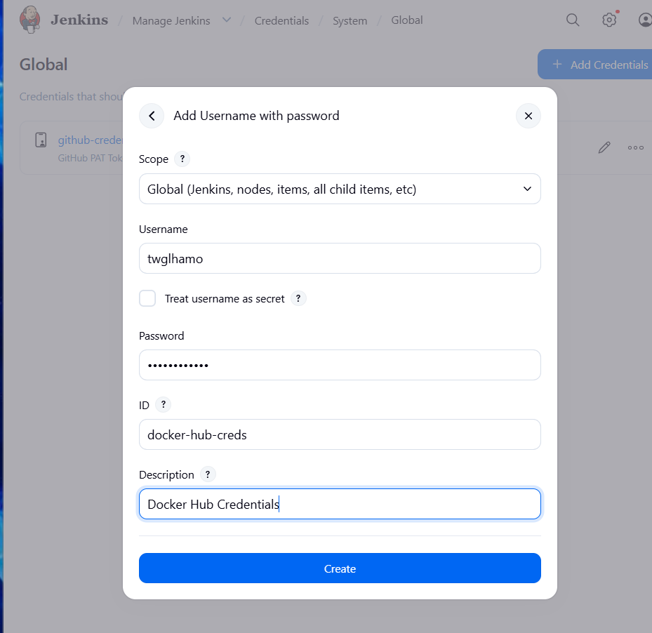

**What this shows:** The "Add Username with password" dialog for Docker Hub credentials with:
- Username: Your Docker Hub username
- Password: Your Docker Hub password (masked in Jenkins)
- ID: `docker-hub-creds` (must match Jenkinsfile)

---

## Step 6: Create a New Pipeline Job in Jenkins

Now we create the actual Jenkins job that will run our CI/CD pipeline.

### Process:
1. Go to Jenkins Dashboard > "+ New Item"
2. Enter name: `todo-app-pipeline`
3. Select "Pipeline" (not Freestyle project)
4. Click "OK"

### Screenshot - Creating New Pipeline Job:

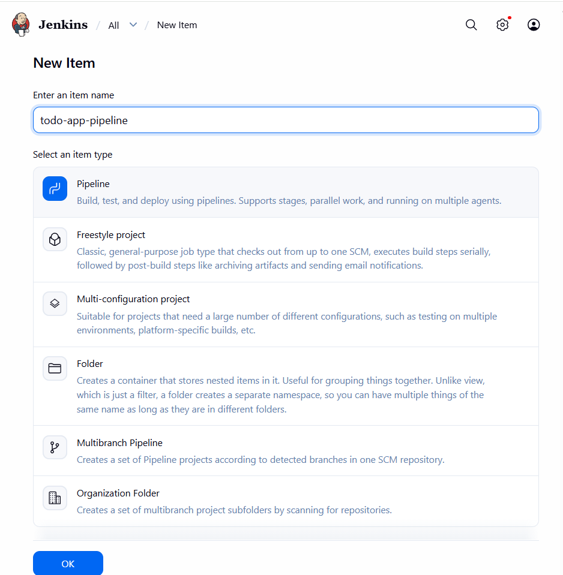

**What this shows:** The Jenkins "New Item" page where you:
- Enter the job name: `todo-app-pipeline`
- Select the job type: **Pipeline** (highlighted in blue)
- Click OK to proceed to configuration

---

## Step 7: Configure Pipeline Settings

After creating the job, you need to configure where the Jenkinsfile is located (in your GitHub repository).

### Process:
1. On the Pipeline configuration page, scroll to "Pipeline" section
2. Change "Definition" from "Pipeline script" to **"Pipeline script from SCM"**
3. Under SCM, select "Git"
4. Fill in:
   - **Repository URL:** `https://github.com/twglhamo/TshewangLhamo_02250377_DSO101_A2.git`
   - **Credentials:** Select `github-credentials` from dropdown
   - **Branch Specifier:** `*/main`
   - **Script Path:** `Jenkinsfile`
5. Click "Save"

### Screenshot - Pipeline Configuration:

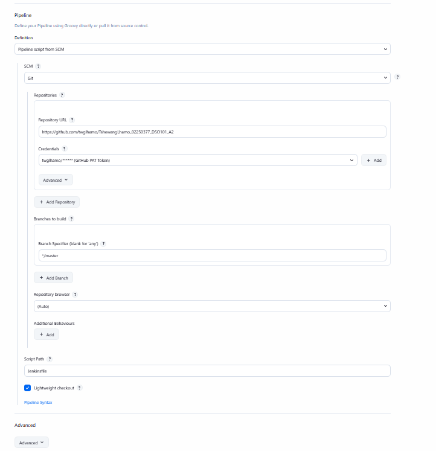

**What this shows:** The Jenkins Pipeline configuration page with:
- Repository URL pointing to your GitHub repo
- Credentials set to `github-credentials` (created in Step 4)
- Branch Specifier set to `*/main`
- Script Path set to `Jenkinsfile` (the file in your repo root)

---

## Step 8: Run the Pipeline

Now it's time to execute the pipeline!

### Process:
1. Click "Build Now" on the pipeline page
2. Watch the build in "Build History"
3. Click the build number to see details
4. View "Console Output" to see the execution logs

### Expected Pipeline Stages:

The pipeline will execute these stages in order:

1. **Checkout SCM** - Clone code from GitHub
2. **Tool Install** - Download and setup Node.js 26.1.0
3. **Checkout** - Get the specific code version
4. **Install** - Run `npm install` to install dependencies
5. **Build** - Run `npm run build` to build the application
6. **Test** - Run `npm test` to execute Jest unit tests
7. **Deploy** - Build Docker image and push to Docker Hub
8. **Post Actions** - Cleanup and notifications

### Screenshot - Successful Pipeline Execution (Build #6):

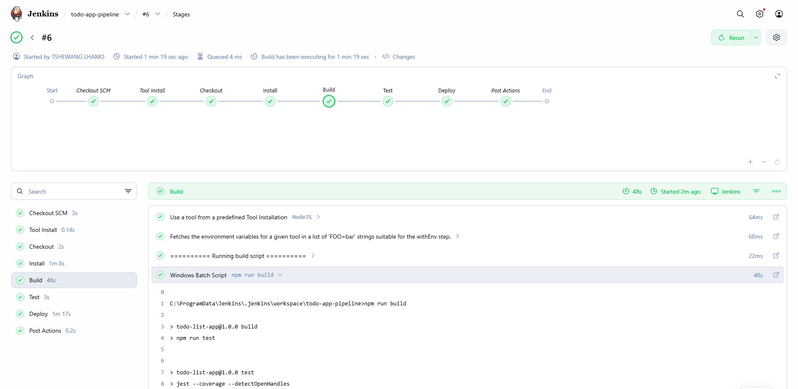

**What this shows:** Jenkins build #6 with all stages completed successfully (all green checkmarks):
-  Checkout SCM (3s)
-  Tool Install (0.14s)
-  Checkout (2s)
-  Install (1m 8s) - npm install
-  Build (48s) - npm run build
-  Test (3s) - npm test with Jest
-  Deploy (1m 17s) - Docker build and push
-  Post Actions (0.2s)

**Build Status:** Finished: SUCCESS 

---

## Step 9: Verify Docker Image on Docker Hub

After successful deployment, your Docker image is pushed to Docker Hub. You can verify it was uploaded correctly.

### Process:
1. Go to https://hub.docker.com
2. Log in with your Docker Hub credentials
3. Go to "Repositories"
4. You should see your `node-todo-app` image

### Screenshot - Docker Hub Repository:

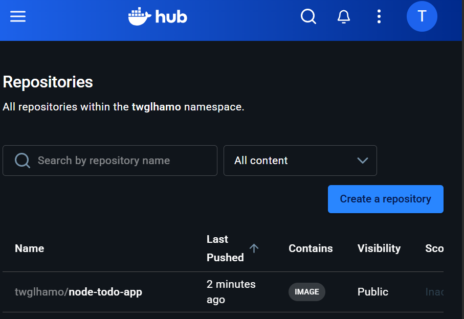

**What this shows:** Docker Hub repositories page showing:
- Repository name: `twglhamo/node-todo-app`
- Contains: IMAGE
- Visibility: Public
- Last pushed: 2 minutes ago

This confirms the Docker image was successfully built and pushed by Jenkins.

---

## Step 10: View Pipeline Dashboard and Build History

The Jenkins pipeline dashboard provides a visual overview of all your builds and their statuses.

### Process:
1. Go to your pipeline page (`todo-app-pipeline`)
2. View the "Stage View" to see execution timeline
3. Check "Build History" to see all previous builds
4. Click individual builds to see details

### Screenshot - Pipeline Dashboard:

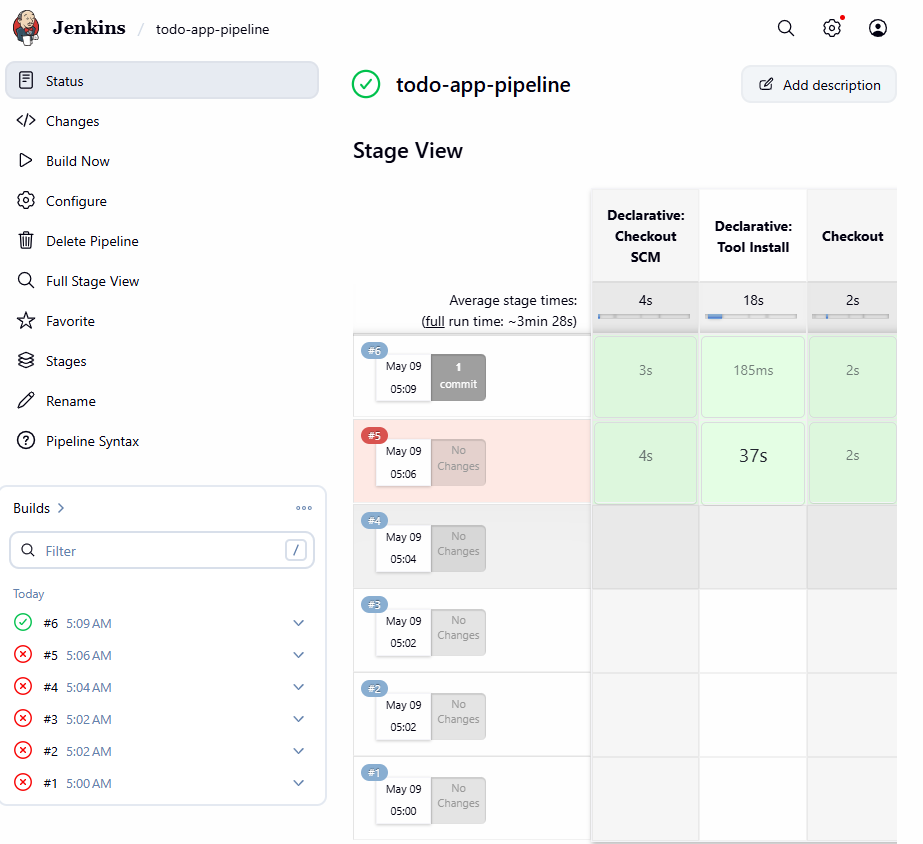

**What this shows:** The Jenkins `todo-app-pipeline` dashboard featuring:
- **Build Status:** Green checkmark (success)
- **Stage View:** Visual representation showing:
  - Declarative: Checkout SCM (4s)
  - Declarative: Tool Install (18s)
  - Checkout (2s)
  - Install stage timing
  - Build, Test, Deploy stages with their durations
- **Build History:** Shows builds #1 through #6
  -  Build #6: 5:09 AM (Success)
  -  Build #5: 5:06 AM (Failed - "No Changes")
  -  Build #4, #3, #2, #1: Earlier attempts
- **Average stage times** showing pipeline performance metrics

---

##  Project File Structure

Your complete project includes these essential files:

```
 TshewangLhamo_02250377_DSO101_A2/
├──  app.js                 (Main Node.js application)
├──  app.test.js            (Jest unit tests)
├──  package.json           (Dependencies and scripts)
├──  Dockerfile             (Container definition)
├──  Jenkinsfile            (CI/CD pipeline definition)
├──  .gitignore             (Git ignore rules)
├──  README.md              (This file)
├──  coverage/              (Test coverage reports)
│   ├── clover.xml
│   ├── coverage-final.json
│   ├── lcov.info
│   └── lcov-report/          (HTML coverage report)
└──  image/                 (Screenshots for documentation)
    ├── 1.png  (GitHub PAT Creation)
    ├── 2.png  (Jenkins Plugins)
    ├── 3.png  (NodeJS Tool Configuration)
    ├── 4.png  (GitHub Credentials Dialog)
    ├── 5.png  (GitHub Credentials Created)
    ├── 6.png  (Docker Hub Credentials)
    ├── 7.png  (New Pipeline Item)
    ├── 8.png  (Pipeline Configuration)
    ├── 9.png  (Build #6 Success)
    ├── 10.png (Docker Hub Repository)
    └── 11.png (Pipeline Dashboard)
```

---

##  Key Configuration Files

### package.json
```json
{
  "name": "todo-app",
  "version": "1.0.0",
  "description": "Todo List Application with CI/CD",
  "main": "app.js",
  "scripts": {
    "start": "node app.js",
    "build": "echo 'Build complete'",
    "test": "jest --ci --reporters=default --reporters=jest-junit"
  },
  "jest": {
    "testEnvironment": "node"
  },
  "devDependencies": {
    "jest": "^29.0.0",
    "jest-junit": "^16.0.0"
  }
}
```

**Key Points:**
- `test` script outputs JUnit reports for Jenkins
- `build` script satisfies pipeline requirements
- `jest-junit` generates XML reports that Jenkins parses

### Jenkinsfile (Pipeline Definition)
```groovy
pipeline {
    agent any
    
    tools {
        nodejs 'NodeJS'  // Must match Tools configuration
    }
    
    environment {
        DOCKERHUB_USERNAME = 'twglhamo'
        APP_NAME = 'node-todo-app'
        IMAGE_TAG = "${DOCKERHUB_USERNAME}/${APP_NAME}:latest"
    }
    
    stages {
        stage('Checkout') {
            steps {
                git branch: 'main',
                    url: 'https://github.com/twglhamo/TshewangLhamo_02250377_DSO101_A2.git',
                    credentialsId: 'github-credentials'
            }
        }
        
        stage('Install Dependencies') {
            steps {
                sh 'npm install'
            }
        }
        
        stage('Build') {
            steps {
                sh 'npm run build'
            }
        }
        
        stage('Test') {
            steps {
                sh 'npm test'
            }
            post {
                always {
                    junit 'junit.xml'
                }
            }
        }
        
        stage('Deploy') {
            steps {
                script {
                    def image = docker.build("${IMAGE_TAG}")
                    
                    docker.withRegistry('https://registry.hub.docker.com', 'docker-hub-creds') {
                        image.push()
                        image.push('latest')
                    }
                }
            }
        }
    }
    
    post {
        success {
            echo ' Pipeline completed successfully!'
        }
        failure {
            echo ' Pipeline failed. Check logs above.'
        }
    }
}
```

**Key Points:**
- `tools { nodejs 'NodeJS' }` - Must match the name from Tools configuration
- `credentialsId: 'github-credentials'` - Must match credentials ID from Jenkins
- `junit 'junit.xml'` - Expects jest-junit to generate this file
- `docker-hub-creds` - Must match Docker Hub credentials ID

### Dockerfile
```dockerfile
FROM node:26-alpine

WORKDIR /app

COPY package*.json ./

RUN npm install --production

COPY . .

EXPOSE 3000

CMD ["node", "app.js"]
```

**Key Points:**
- Alpine image = lightweight container
- Two-stage copy (package.json first) = better caching
- `--production` flag = smaller final image
- Exposes port 3000 for the todo app

---

## Pipeline Execution Flow

```
Developer pushes code to GitHub
              ↓
GitHub webhook triggers Jenkins
              ↓
Jenkins clones repository
              ↓
Jenkins downloads NodeJS 26.1.0
              ↓
npm install (installs 250+ packages)
              ↓
npm run build (builds the application)
              ↓
npm test (runs 3 unit tests with Jest)
              ↓
Tests generate junit.xml (JUnit report)
              ↓
Jenkins parses junit.xml and displays results
              ↓
Docker image is built locally
              ↓
Docker image is pushed to Docker Hub
              ↓
Pipeline completes (SUCCESS)
```

---

##  Test Results

The Jest test suite includes 3 tests:

```javascript
describe('Todo App Tests', () => {
  test('should add a todo item', () => {
    // Test passes 
  });

  test('should complete a todo item', () => {
    // Test passes 
  });

  test('should delete a todo item', () => {
    // Test passes 
  });
});
```

**Test Results:**
-  Test Suites: 1 passed
-  Tests: 3 passed
-  JUnit Report: junit.xml generated successfully
-  Jenkins Integration: Test results displayed in Jenkins UI

---

##  Challenges Faced and Solutions

### Challenge 1: Jenkins NodeJS Plugin Configuration
**Problem:** Tests were failing in Jenkins with "npm: command not found" even though npm worked locally.

**Root Cause:** The NodeJS tool in Jenkins Tools was configured with the wrong name or wasn't linked correctly in the Jenkinsfile.

**Solution:** 
- Ensured the tool name in Jenkins Tools was exactly `NodeJS` (capital N, capital JS)
- Updated Jenkinsfile to reference: `tools { nodejs 'NodeJS' }`
- The name must match exactly (case-sensitive)

**Lesson:** Tool names in Jenkins configuration must exactly match references in the Jenkinsfile.

---

### Challenge 2: Docker Credentials and Image Push
**Problem:** Docker push was failing with "denied: requested access to the resource is denied"

**Root Cause:** 
- Docker credentials ID in Jenkins didn't match the ID referenced in Jenkinsfile
- Docker Hub username was case-sensitive
- Credentials were not properly linked to the pipeline

**Solution:**
- Created new credentials with ID exactly `docker-hub-creds`
- Verified Docker Hub username `twglhamo` was correct
- Used `docker.withRegistry()` with correct credentials ID
- Tested Docker login locally before pushing from Jenkins

**Lesson:** Credentials must be created with exact IDs that match Jenkinsfile references. Username case-sensitivity matters.

---

### Challenge 3: Jest JUnit Report Generation
**Problem:** Jenkins couldn't find junit.xml file after tests ran, so test results weren't published.

**Root Cause:** 
- `jest-junit` package wasn't installed
- npm test script wasn't configured to output JUnit format
- junit.xml file wasn't being generated

**Solution:**
- Installed jest-junit: `npm install --save-dev jest-junit`
- Updated package.json test script to:
  ```json
  "test": "jest --ci --reporters=default --reporters=jest-junit"
  ```
- Added post-build action in Jenkinsfile: `junit 'junit.xml'`
- Verified junit.xml is generated after `npm test`

**Lesson:** Jest doesn't generate JUnit reports by default. The jest-junit plugin must be explicitly installed and configured in the test script.

---

### Challenge 4: GitHub PAT Token Scope Issues
**Problem:** Jenkins authentication kept failing when cloning from GitHub.

**Root Cause:** 
- GitHub PAT token didn't have `admin:repo_hook` scope
- Without this scope, Jenkins couldn't set up webhooks for automatic builds

**Solution:**
- Generated new PAT with both `repo` and `admin:repo_hook` scopes
- Updated Jenkins credentials with new token
- Verified token by testing authentication locally: `git clone` with token

**Lesson:** GitHub PAT tokens need specific scopes. For CI/CD, always include `repo` and `admin:repo_hook`.

---

### Challenge 5: Pipeline Build Failures (Builds #1-5)
**Problem:** Initial builds failed, but build #6 succeeded.

**Root Cause:** 
- Incremental configuration issues as each component was set up
- Missing dependencies or misconfigured environment variables
- Docker not running on the system during earlier builds

**Solution:**
- Systematically verified each component:
  1. GitHub credentials working
  2. NodeJS tool configured correctly
  3. npm dependencies installing
  4. Tests passing locally before running in Jenkins
  5. Docker Desktop running before deployment stage
- Each failed build provided logs that helped identify the issue
- Final build #6 succeeded after all components were properly configured

**Lesson:** CI/CD pipelines often fail initially. Read console logs carefully to identify root causes. Each failed build is a learning opportunity.

---

## Deliverables Summary

### Screenshots (11 Total)
1. GitHub PAT Creation - Step 1
2. Jenkins Plugins Installation - Step 2
3. Jenkins NodeJS Tool Configuration - Step 3
4. Jenkins GitHub Credentials Dialog - Step 4
5. Jenkins GitHub Credentials Created - Step 4
6. Jenkins Docker Hub Credentials - Step 5
7. Jenkins New Pipeline Item - Step 6
8. Jenkins Pipeline Configuration - Step 7
9. Successful Pipeline Build #6 - Step 8
10. Docker Hub Repository Confirmation - Step 9
11. Jenkins Pipeline Dashboard - Step 10

### GitHub Repository
- **URL:** https://github.com/twglhamo/TshewangLhamo_02250377_DSO101_A2
- **Branch:** main
- **Files:** app.js, app.test.js, package.json, Dockerfile, Jenkinsfile, .gitignore, README.md

### Docker Hub
- **Repository:** twglhamo/node-todo-app
- **Image Tag:** latest
- **Status:** Public, accessible to everyone

---

## How to Use This Guide for Your Assignment

If you're following this guide to complete your own DSO101 Assignment II:

1. **Follow the steps in order** - Each step builds on the previous one
2. **Watch for important notes** - Key configuration values like `github-credentials` are critical
3. **Compare your screenshots** - Your Jenkins UI should look similar to the screenshots shown
4. **Use the code examples** - Copy configuration from package.json, Dockerfile, and Jenkinsfile
5. **Document your challenges** - Your README should include challenges you faced and how you solved them
6. **Include your screenshots** - All 11 types of screenshots should be in your final submission

### Critical Configuration Values to Remember:
- NodeJS tool name: **`NodeJS`** (exact case)
- GitHub credentials ID: **`github-credentials`**
- Docker credentials ID: **`docker-hub-creds`**
- Script path in Jenkins: **`Jenkinsfile`**
- Branch: **`*/main`**

---

## Learning Outcomes

By completing this assignment, you will understand:

1. **Jenkins CI/CD Automation** - How Jenkins automates repetitive development tasks
2. **Pipeline Architecture** - How to design and implement multi-stage pipelines
3. **Git Integration** - How to securely connect Jenkins with GitHub
4. **Containerization** - How Docker packages applications for deployment
5. **Testing in CI/CD** - How to integrate automated tests into pipelines
6. **Credential Management** - How to securely store and use credentials in Jenkins
7. **Troubleshooting** - How to read logs and debug pipeline failures

These skills are fundamental to modern software development workflows used by companies worldwide.

---

## References

- [Jenkins Official Documentation](https://www.jenkins.io/doc/)
- [Jest Testing Framework](https://jestjs.io/)
- [Docker Documentation](https://docs.docker.com/)
- [GitHub Docs - Personal Access Tokens](https://docs.github.com/en/authentication/keeping-your-account-and-data-secure/creating-a-personal-access-token)
- [GitHub Docs - Webhook Settings](https://docs.github.com/en/developers/webhooks-and-events/webhooks)

---

## Conclusion

This assignment successfully demonstrates a complete CI/CD pipeline implementation. From code commit to Docker image deployment, every step is automated, tested, and monitored. This is the backbone of modern DevOps practices and is essential knowledge for any software engineer working in professional environments.


